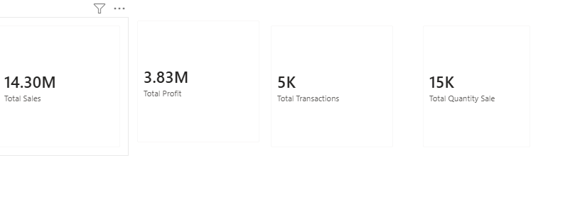
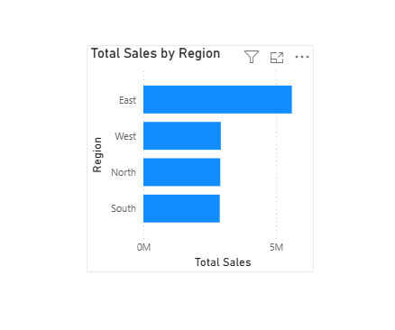
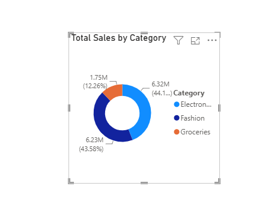
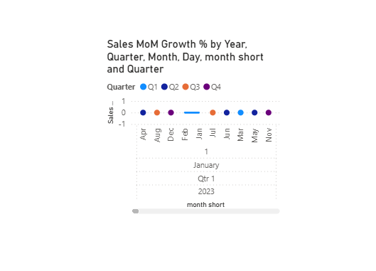
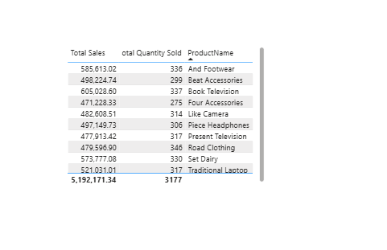
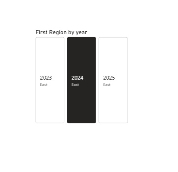

# Retail Sales Data Analysis - Power BI Project

## Overview
This project analyzes retail sales data across multiple regions and time 
periods to identify high-performing markets, seasonal sales trends, and 
profitable product categories — helping businesses decide where to focus 
product distribution and marketing for maximum profit.

## Objective
- Analyze sales and profit performance across North, South, East, and West regions
- Identify which region generates the highest sales and profit
- Perform time intelligence analysis (yearly, monthly, weekly) to spot sales trends
- Recommend where and when to focus specific products for maximum profit

## Approach
1. Imported and modeled retail sales data (Transactions, Products, Stores, Customers)
2. Built a Calendar table for time intelligence (Year, Quarter, Month, Week)
3. Created DAX measures for Total Sales, Total Profit, Total Transactions, 
   Quantity Sold, and Sales MoM Growth %
4. Built region-wise sales & profit comparison visuals (Clustered Bar Chart)
5. Analyzed category-wise sales/profit distribution (Donut Chart)
6. Tracked monthly/quarterly sales trend over time (Line Chart)
7. Combined regional + category + time-based insights to build final recommendation

## Dashboard

### Overview
Key metrics at a glance — Total Sales, Total Profit, Total Transactions, and Quantity Sold.

### Regional Analysis
Sales and profit comparison across North, South, East, and West regions.

### Categorical Analysis
Sales distribution across product categories (Fashion, Electronics, Groceries, etc.)

### Sales Trend
Monthly/quarterly sales trend with Month-over-Month growth %.

### Top 10 Products Filter
Top-performing products ranked by sales and quantity sold.

### Interactive Slicer
Region and year slicers for dynamic filtering across the report.

## Key Insights
- **East region** is the top performer — generating ₹56.0L in sales and 
  ₹18.1L in profit, nearly double any other single region
- **2024** was the peak year for sales (₹70.3L), showing strong year-over-year growth
- **December and June** are the strongest sales months, while **February** is the weakest
- **Fashion** category delivers the highest profit (₹20.1L), narrowly ahead of 
  Electronics (₹19.9L), while Groceries lags behind
- Top profit-driving products come from **Footwear, Smartphones, and Television** 
  categories

## Recommendation
Focus marketing and inventory push on **Fashion and Electronics products in the 
East region during June and December** — this combination aligns with the 
highest-performing region, category, and season, offering the strongest 
potential for profit growth.

## Tools Used
Power BI (Data Modeling, DAX, Calendar Table, Time Intelligence, Visualizations)

## Files
- `retail_sales_powerbi_project.pbix` — Complete Power BI project file
